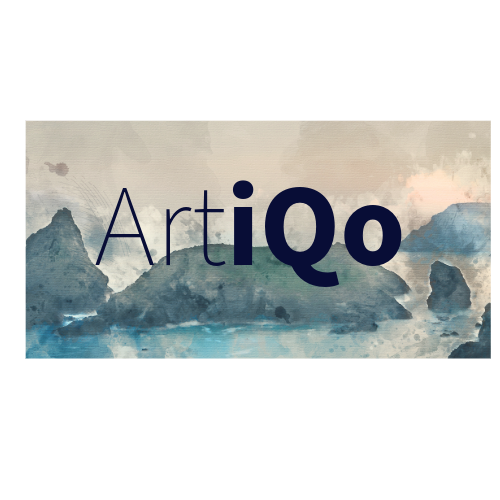
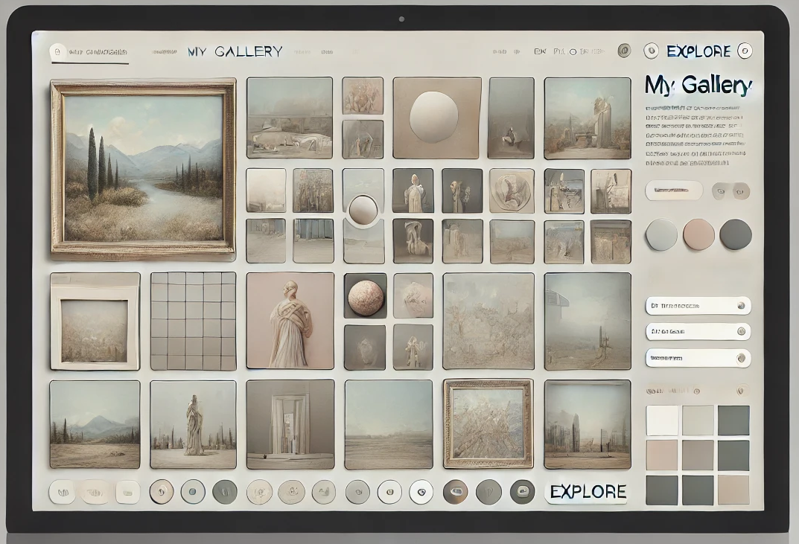
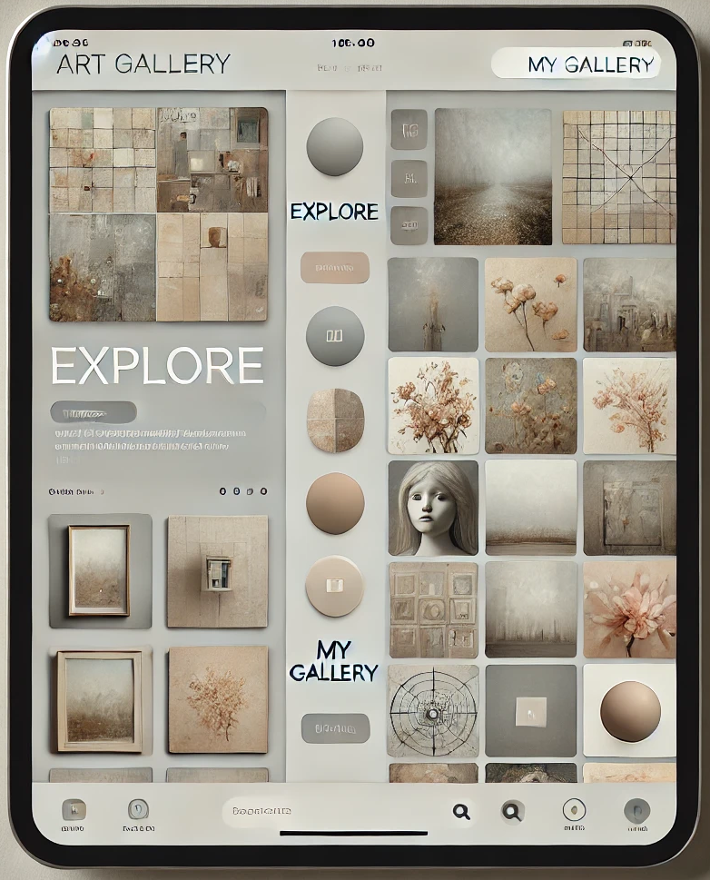
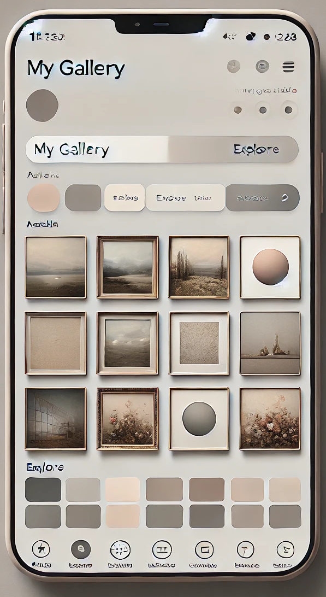

---


# 🎨 **Artiqo: Your Personal Art Gallery and Creative Hub**

Welcome to **Artiqo**, a vibrant platform that connects art lovers, creators, and communities. Whether you're here to curate your personal gallery, explore famous works from museums worldwide, or share your own artistic journey, Artiqo provides the space for creativity to flourish.

> 🌍 *"Art enables us to find ourselves and lose ourselves at the same time."* — Thomas Merton

---


## 🌟 **Core Features**

### 🎨 **Explore Open-Source Art**
Browse through thousands of open-source artworks sourced from the world's top museums and art collections via public APIs. Discover hidden gems, historic masterpieces, and contemporary works across various styles and movements.

### 🖼️ **Create Your Own Art Gallery**
Build your personal gallery by favoriting artworks that resonate with you. Curate and organize your collection, and share it with others in the community.

### 👩‍🎨 **Support Living Artists Through the Public Gallery**
Artiqo’s **Public Gallery** is more than just a collection of historic art. It also serves as a platform to appreciate and engage with **living artists**. Discover new talent and view contemporary pieces created by artists who are actively contributing to today’s art world. Users can browse, comment, and support the works of modern-day creators, fostering a deeper connection between the audience and current artists.

You can also show your support by following their journeys, sharing their work, and even purchasing exclusive pieces directly from their profiles.

### 💎 **Exclusive Premium Collections**
Unlock access to rare, curated art collections for a one-time or subscription fee. Dive deep into thematic collections such as Renaissance masterpieces, modern art, and exclusive artist features.

### 📖 **Art Journey Blog**
Share your artistic experiences, favorite exhibitions, and inspirations in your own personal blog. Whether you're an artist, collector, or just a lover of art, you can tell your story here.

### 🎨 **Upload and Share Your Original Artwork**
Display your own creations and gain feedback from the community. Artiqo offers artists the chance to showcase their original work in a dedicated gallery for others to explore, comment, and appreciate.

### 👥 **Collaborate with Other Artists**
Join forces with fellow creators on collaborative art projects. From themed challenges to community murals, Artiqo fosters a sense of teamwork and innovation within the art world.

### 💬 **Engage in the Community**
Discuss your favorite pieces, leave insightful comments, and build connections with other art enthusiasts. Artiqo is as much about dialogue as it is about discovery.

---

## 📷 **Screenshots**

Here are some highlights of the Artiqo experience:

### **Explore Public Art Collections**


### **Curate Your Gallery**


### **Support Living Artists**


---

## 🌍 **APIs and Integrations**

Artiqo leverages powerful integrations with open museum APIs, bringing the art world to your fingertips:

- [Metropolitan Museum of Art API](https://metmuseum.github.io/)
- [Rijksmuseum API](https://www.rijksmuseum.nl/en/api)
- [Art Institute of Chicago API](https://api.artic.edu/)

We are always adding more sources to expand our collections and features that help support contemporary artists.

---

## 🚀 **Getting Started**

### Prerequisites

- **Node.js**: Ensure you have [Node.js](https://nodejs.org/en/) installed.
- **Git**: You'll need Git for version control. [Git Installation Guide](https://git-scm.com/book/en/v2/Getting-Started-Installing-Git)
- **Postgres**: We use MongoDB to store user data and artwork collections.

### Installation

1. Clone the repository:
   ```bash
   git clone https://github.com/Artico/Artiqo.git
   ```

2. Navigate to the project directory:
   ```bash
   cd Artiqo
   ```

3. Install dependencies:
   ```bash
   npm install
   ```

4. Start the development server:
   ```bash
   npm start
   ```

5. Open your browser and visit `http://localhost:3000`.

---

## 💡 **Roadmap**

Here are some of the exciting features coming soon to Artiqo:

- **NFT Integration**: Tokenize and trade original artworks directly on the platform.
- **Advanced Search Filters**: Search for artworks based on color palette, mood, and style.
- **Art History Timeline**: Explore art movements and historical contexts as you view artworks.
- **Virtual Exhibitions**: Attend live and recorded exhibitions hosted by artists around the world.

---

## 🛠️ **Tech Stack**

- **Frontend**: React, Strapi, MUI, Tailwind CSS
- **Backend**: Node.js, React
- **Database**: Postgres
- **Authentication**: JWT (JSON Web Tokens)
- **APIs**: Museum Art APIs (Met Museum, Rijksmuseum, etc.)
- **Cloud Storage**: AWS S3 for hosting user-uploaded artworks

---

## 🤝 **Contributing**

Contributions are what make Artiqo an amazing platform for art lovers. If you’d like to contribute, please follow these steps:

1. Fork the repository.
2. Create a new branch: `git checkout -b feature/your-feature-name`.
3. Make your changes and commit: `git commit -m "Add some feature"`.
4. Push to the branch: `git push origin feature/your-feature-name`.
5. Submit a pull request.

---

## 📝 **License**

This project is licensed under the MIT License - see the [LICENSE](LICENSE) file for details.

---

## 💬 **Connect with Us**

Stay updated and follow our journey:

- [Instagram](https://instagram.com/ArtiqoApp)
- [Twitter](https://twitter.com/ArtiqoApp)
- [Facebook](https://facebook.com/ArtiqoApp)

---

